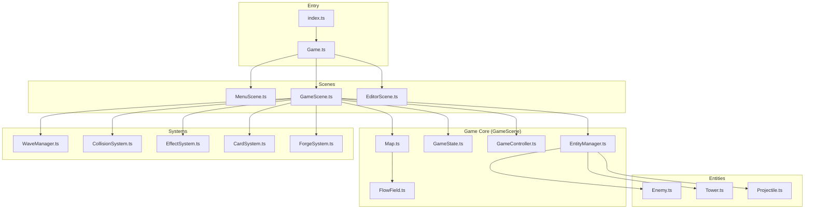

# NewTower 1.4 Alfa — Architecture Overview

## Project Summary

A **tower defense game** built with TypeScript, Canvas 2D, and Vite. Features card-based tower upgrades, procedural asset generation, and sophisticated rendering systems.

---

## Core Architecture



---

## Key Files & Responsibilities

### 🎮 Game Loop

| File | Role |
|------|------|
| `src/Game.ts` | Main game loop, scene management, input |
| `src/scenes/GameScene.ts` | Core gameplay orchestrator, implements `IGameScene` |
| `src/scenes/EditorScene.ts` | Wave/map editor ([Docs](editor_system.md)) |

---

### 🏰 Entities

| File | Role |
|------|------|
| `src/Enemy.ts` | Enemy entity with HP, armor, status effects (slow, burn DOT tick), pathfinding |
| `src/Tower.ts` | Tower entity with cards, stats calculation, targeting modes |
| `src/Projectile.ts` | Pooled projectile with effects, pierce, crits, trails |

---

### 🎨 Rendering System

**Turret Renderers** (`src/renderers/turrets/`):

- `FireTurretRenderer.ts` — Fire turret
- `IceTurretRenderer.ts` — Ice turret with crystal
- `SniperTurretRenderer.ts` — Sniper with laser
- `SplitTurretRenderer.ts` — Multishot turret
- `MinigunTurretRenderer.ts` — "Void Prism" spinning crystal

**Unit Renderers** (`src/renderers/units/`):

- `SkeletonUnitRenderer.ts`
- `HellhoundUnitRenderer.ts`
- `OrcUnitRenderer.ts`
- `TrollUnitRenderer.ts`
- `SpiderUnitRenderer.ts`
- `WraithUnitRenderer.ts`
- `GoblinUnitRenderer.ts`
- `RatUnitRenderer.ts`
- `MagmaUnitRenderer.ts`
- `SkeletonCommanderUnitRenderer.ts`

### 🖥️ Rendering Pipeline & Coordinates [NEW]

The game uses a **Logical Coordinate System** decoupled from physical pixels to support High-DPI screens.

- **Logical Size (Game Units):** `Game.width`, `Game.height` (matches CSS pixels).
- **Physical Size (Buffer):** `canvas.width`, `canvas.height` (matches Device Pixels).
- **Scaling:** `ctx` is automatically scaled by `dpr` (Device Pixel Ratio, capped at 2.0).

**Render Graph Layers (GameScene.draw):**

1. **Map/Ground**: Tiles, Torches, Decals (Acid, Tracks).
2. **Objects**: Towers, Useable Items.
3. **Units**: Enemies (Sorted by Y for depth).
4. **VFX**: Projectiles, Explosions, Particles.
5. **Overlay**: Fog of War (Post-VFX), Lighting, Emissive.
6. **UI**: Tooltips, HUD (HTML Overlay).

**Key Rules:**

1. **Always use** `game.width` / `game.height` for logic, UI positioning, and drawing.
2. **Never use** `game.canvas.width` directly unless dealing with raw buffer operations (e.g. `clearRect`).
3. **Input:** `InputSystem` automatically maps physical pointer events to logical coordinates.

---

### ⚙️ Systems

| File | Role |
|------|------|
| `src/WaveManager.ts` | Wave spawning, patterns (Normal/Random/Swarm) |
| `src/CollisionSystem.ts` | Projectile-enemy collision via SpatialGrid, applies splash/slow/burn effects |
| `src/FlowField.ts` | Vector Field pathfinding for mass unit movement |
| `src/EffectSystem.ts` | Visual effects: explosions, particles, debris |
| `src/CardSystem.ts` | Hand management, drag-drop to towers/forge |
| `src/ForgeSystem.ts` | Card combining/upgrading |
| `src/systems/TargetingSystem.ts` | Centralized O(1) targeting logic with hysteresis |
| `src/systems/ProjectileSystem.ts` | Projectile pooling and lifecycle management |
| `src/WeaponSystem.ts` | Firing logic, cooldowns, recoil, gated shooting |
| `src/SaveManager.ts` | Persistence, schema versioning, safe save cadence |

---

### 🖥️ UI Components

| File | Role |
|------|------|
| `index.html` | All CSS styles + HTML structure for UI panels |
| `src/ui/GameHUD.ts` | HUD: Lives, Money, Wave, Enemy counter, Forge button |
| `src/ui/ShopUI.ts` | Shop: Slot rendering, Buy/Reroll, selection logic |
| `src/ForgeSystem.ts` | Forge: Slot management, drag-drop, evolution modal |

---

### 🃏 Card Types (`src/cards/`)

| Type | Effect |
|------|--------|
| 🔥 FIRE | AoE splash, burn DOT (Napalm evolution), explosion on death |
| ❄️ ICE | Slow effect, chains at Lv3 |
| 🎯 SNIPER | Long range, high damage, crit at Lv3 |
| 💥 MULTISHOT | Multiple projectiles, evolution-aware config (Barrage/Storm/Homing) |
| ⚡ MINIGUN | Attack speed ramp, overheat mechanic |

---

### 👹 Enemy Archetypes (`src/config/Enemies.ts`)

| ID | Name | Archetype |
|----|------|-----------|
| GRUNT | Скелет | SKELETON |
| SCOUT | Адская Гончая | HELLHOUND |
| TANK | Воевода Орков | ORC |
| BOSS | Призрак Пустоты | WRAITH |
| SKELETON_COMMANDER | Командир | SKELETON_COMMANDER |
| SPIDER_POISON | Ядовитый | SPIDER |
| TROLL_ARMORED | Латник | TROLL |
| GOBLIN | Гоблин | GOBLIN |
| SAPPER_RAT | Крыса | RAT |
| MAGMA_KING | Король Магмы | MAGMA |

---

### 🎨 Assets & Visual Config

| File | Role |
|------|------|
| `src/Assets.ts` | Procedural texture generation (1800+ lines). **Pre-bakes heavy effects (Auras, Glows) for performance.** |
| `src/VisualConfig.ts` | Color palettes for all objects |
| `src/ProceduralPatterns.ts` | Noise/pattern utilities |

---

### 🎨 Design Token System (`src/design/`)

UI styling uses a centralized token system for visual consistency:

| File | Exports | Purpose |
|------|---------|--------|
| `colors.ts` | `UI_COLORS` | Primary, status, glass bg/border |
| `spacing.ts` | `UI_SPACING` | xs/sm/md/lg/xl scale |
| `borders.ts` | `UI_BORDERS` | radius (sm/md/lg), width, style |
| `shadows.ts` | `UI_SHADOWS` | Drop shadows for elements |
| `transitions.ts` | `UI_TRANSITIONS` | Duration (fast/normal), easing |
| `fonts.ts` | `UI_FONTS` | Families, sizes, weights |

> CSS values in `index.html` should reference these tokens via comments (e.g., `/* = UI_BORDERS.radius.lg */`).

---

### 📁 Directory Structure

```
src/
├── cards/              # Card type definitions
├── config/             # Game config (Enemies, Towers, Levels)
├── design/             # UI design tokens (colors, spacing, borders, shadows, transitions)
├── editor/             # Wave editor components
├── effects/            # Visual effect helpers
├── renderers/          # All rendering logic
│   ├── turrets/        # Turret renderers
│   └── units/          # Enemy renderers
├── scenes/             # Game scenes
├── systems/            # Subsystems
├── ui/                 # UI components (GameHUD, ShopUI)
└── utils/              # Utility functions
```

---

## Key Integration Points

1. **Entity → Renderer**: Entities delegate drawing via `RendererFactory`
2. **Config → Entity**: `CONFIG.ENEMY_TYPES` and `CONFIG.CARD_TYPES` define all types
3. **Assets → Renderers**: `Assets.get('name')` provides procedural textures
4. **Scene → Systems**: `GameScene` orchestrates via `IGameScene` interface
5. **Cards → Tower Stats**: `Tower.getStats()` merges effects via `CardStackingSystem`, multishot config via `getMultishotConfig(level, evolutionPath?)`

---

## Simulation Stability Contract

To ensure long-running simulation stability (no memory leaks, no "ghost" behaviors), the following contracts are strictly enforced:

### 1. Strict Lifecycle Management

When exiting `GameScene`, cleanup MUST occur in this specific order to prevent race conditions:

1. **Stop Logic**: `GameController.dispose()` (Stop input, timers, events).
2. **Stop UI**: `UI.destroy()` (Detach DOM elements).
3. **Destroy Session**: `GameSession.destroy()` (Clear systems, Entity Pools).

### 2. Pooling Integrity

Object Pools (Enemy, Projectile) must guarantee "Factory-Fresh" state upon reuse.

- **Deep Reset**: `reset()` methods must clear ALL runtime state (physics, visual flags, timers, path indices).
- **No-Alloc Reset**: `reset()` must NOT allocate new arrays/objects. Use `.length = 0` or static empty constants (e.g., `Projectile.EMPTY_EFFECTS`).
- **Safe Removal**: When removing from active lists, the order is: `Reset` -> `Pool` -> `Swap/Remove`.

### 3. Separation of Concerns (Physics vs Visuals)

- **Projectiles**: Pure physics/logic containers. `update()` does NOT spawn visual effects directly.
- **ProjectileSystem**: Orchestrates visual side-effects (trails) based on projectile state. This ensures deterministic simulation logic is decoupled from rendering density.
