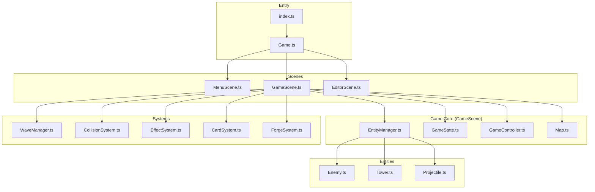

# NewTower 1.4 Alfa — Architecture Overview

## Project Summary

A **tower defense game** built with TypeScript, Canvas 2D, and Vite. Features card-based tower upgrades, procedural asset generation, and sophisticated rendering systems.

---

## Core Architecture



---

## Key Files & Responsibilities

### 🎮 Game Loop

| File | Role |
|------|------|
| `src/Game.ts` | Main game loop, scene management, input |
| `src/scenes/GameScene.ts` | Core gameplay orchestrator, implements `IGameScene` |
| `src/scenes/EditorScene.ts` | Wave/map editor |

---

### 🏰 Entities

| File | Role |
|------|------|
| `src/Enemy.ts` | Enemy entity with HP, armor, status effects, pathfinding |
| `src/Tower.ts` | Tower entity with cards, stats calculation, targeting modes |
| `src/Projectile.ts` | Pooled projectile with effects, pierce, crits, trails |

---

### 🎨 Rendering System

**Turret Renderers** (`src/renderers/turrets/`):

- `FireTurretRenderer.ts` — Fire turret
- `IceTurretRenderer.ts` — Ice turret with crystal
- `SniperTurretRenderer.ts` — Sniper with laser
- `SplitTurretRenderer.ts` — Multishot turret
- `MinigunTurretRenderer.ts` — "Void Prism" spinning crystal

**Unit Renderers** (`src/renderers/units/`):

- `SkeletonUnitRenderer.ts`
- `HellhoundUnitRenderer.ts`
- `OrcUnitRenderer.ts`
- `TrollUnitRenderer.ts`
- `SpiderUnitRenderer.ts`
- `WraithUnitRenderer.ts`
- `GoblinUnitRenderer.ts`
- `RatUnitRenderer.ts`
- `MagmaUnitRenderer.ts`
- `SkeletonCommanderUnitRenderer.ts`

---

### ⚙️ Systems

| File | Role |
|------|------|
| `src/WaveManager.ts` | Wave spawning, patterns (Normal/Random/Swarm) |
| `src/CollisionSystem.ts` | Projectile-enemy collision via SpatialGrid |
| `src/EffectSystem.ts` | Visual effects: explosions, particles, debris |
| `src/CardSystem.ts` | Hand management, drag-drop to towers/forge |
| `src/ForgeSystem.ts` | Card combining/upgrading |

---

### 🃏 Card Types (`src/cards/`)

| Type | Effect |
|------|--------|
| 🔥 FIRE | AoE damage, burn, explosion on death |
| ❄️ ICE | Slow effect, chains at Lv3 |
| 🎯 SNIPER | Long range, high damage, crit at Lv3 |
| 💥 MULTISHOT | Multiple projectiles |
| ⚡ MINIGUN | Attack speed ramp, overheat mechanic |

---

### 👹 Enemy Archetypes (`src/config/Enemies.ts`)

| ID | Name | Archetype |
|----|------|-----------|
| GRUNT | Скелет | SKELETON |
| SCOUT | Адская Гончая | HELLHOUND |
| TANK | Воевода Орков | ORC |
| BOSS | Призрак Пустоты | WRAITH |
| SKELETON_COMMANDER | Командир | SKELETON_COMMANDER |
| SPIDER_POISON | Ядовитый | SPIDER |
| TROLL_ARMORED | Латник | TROLL |
| GOBLIN | Гоблин | GOBLIN |
| SAPPER_RAT | Крыса | RAT |
| MAGMA_KING | Король Магмы | MAGMA |

---

### 🎨 Assets & Visual Config

| File | Role |
|------|------|
| `src/Assets.ts` | Procedural texture generation (1800+ lines). **Pre-bakes heavy effects (Auras, Glows) for performance.** |
| `src/VisualConfig.ts` | Color palettes for all objects |
| `src/ProceduralPatterns.ts` | Noise/pattern utilities |

---

### 📁 Directory Structure

```
src/
├── cards/              # Card type definitions
├── config/             # Game config (Enemies, Towers, Levels)
├── design/             # UI design tokens
├── editor/             # Wave editor components
├── effects/            # Visual effect helpers
├── renderers/          # All rendering logic
│   ├── turrets/        # Turret renderers
│   └── units/          # Enemy renderers
├── scenes/             # Game scenes
├── systems/            # Subsystems
├── ui/                 # UI components
└── utils/              # Utility functions
```

---

## Key Integration Points

1. **Entity → Renderer**: Entities delegate drawing via `RendererFactory`
2. **Config → Entity**: `CONFIG.ENEMY_TYPES` and `CONFIG.CARD_TYPES` define all types
3. **Assets → Renderers**: `Assets.get('name')` provides procedural textures
4. **Scene → Systems**: `GameScene` orchestrates via `IGameScene` interface
5. **Cards → Tower Stats**: `Tower.getStats()` merges effects via `CardStackingSystem`
