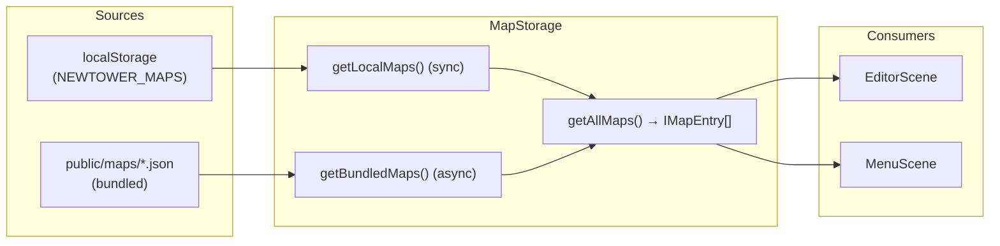

# 📦 Map Storage System (MapStorage.ts)

Гибридная система хранения карт: bundled JSON + localStorage.

---

## Архитектура



---

## API Reference

| Метод | Тип | Описание |
| --- | --- | --- |
| `getLocalMaps()` | sync | Все карты из localStorage |
| `saveLocal(name, data)` | sync | Сохранить в localStorage |
| `deleteLocal(name)` | sync | Удалить из localStorage |
| `getBundledMaps()` | async | Fetch из `public/maps/`, кэширует |
| `getAllMaps()` | async | Merge: bundled + local, collision = Local Override |
| `isBundled(name)` | async | Проверка — есть ли в bundled |
| `importFromFile(file)` | async | File → JSON.parse → migrateMapData → validateMap |
| `createExportBlob(data)` | sync | IMapData → JSON Blob для скачивания |
| `sanitizeFileName(name)` | sync | Безопасное имя файла (ASCII, lowercase) |
| `invalidateBundledCache()` | sync | Сброс кэша (для HMR) |

---

## Collision Policy: Local Override

| Ситуация | UI | Удаление |
| --- | --- | --- |
| Только bundled | `📦 name` | Заблокировано |
| Только local | `💾 name` | Разрешено |
| Оба (override) | `💾 name ⚡` + кнопка `⟳` | Удаляет local → bundled восстанавливается |

---

## Добавление bundled карты

1. Создать JSON файл карты (формат `IMapData`)
2. Положить в `public/maps/my_map.json`
3. Имя файла: **ASCII, lowercase, `_` вместо пробелов**. Пример: `boss_rush.json`
4. `_index.json` генерируется автоматически Vite-плагином

> [!IMPORTANT]
> Файлы, начинающиеся с `_` (например, `_index.json`), исключаются из индекса.

---

## Import / Export Flow

### Export (EditorScene)

```text
1. User clicks "📥 Экспорт JSON"
2. EditorScene reads current map from MapStorage.getLocalMaps()
3. MapStorage.createExportBlob(data) → Blob
4. Create <a download="map_name.json"> → click → revokeObjectURL
```

### Import (EditorScene)

```text
1. User clicks "📤 Импорт JSON" → hidden <input type="file">.click()
2. User selects .json file
3. MapStorage.importFromFile(file):
   a. file.text() → JSON.parse()
   b. migrateMapData(raw) — schema migration
   c. validateMap(migrated) — waypoints ≥ 2, path validity
4. prompt("Имя карты:", filename)
5. Conflict check: if name exists → confirm("Перезаписать?")
6. MapStorage.saveLocal(name, data)
7. EditorScene.loadMap(name, data)
8. refreshMapsPanel()
```

---

## Vite Plugin (`mapsIndexPlugin`)

Автогенерация `public/maps/_index.json`:

- **Build time:** `buildStart` → scan `public/maps/` → write `_index.json`
- **Dev server:** Watcher на `add`/`unlink` событий с debounce 300ms → regenerate + `full-reload`
- **Filter:** `*.json`, исключая `_*.json`

---

## Ключевые контракты

1. **Bundled миграция**: `getBundledMaps()` прогоняет каждую карту через `migrateMapData()` + `validateMap()`. Без этого при изменении `IMapData` — тихий крэш.
2. **Race condition guard**: `_refreshGeneration` counter в EditorScene и MenuScene. Устаревшие промисы отбрасываются.
3. **Кэширование**: Bundled maps кэшируются на сессию. `_index.json` запрашивается с `cache: 'no-cache'`.
4. **`import.meta.env.BASE_URL`**: Используется для resolve путей. Fallback к `./` в тестах.

---

## Тестирование

Файл: `__tests__/MapStorage.test.ts` (21 тест)

| Группа | Покрытие |
| --- | --- |
| Local Maps | CRUD, corrupted localStorage |
| Bundled Maps | 404, invalid JSON, empty array, migration, skip invalid, caching, invalidation |
| getAllMaps | Local Override, overridesBundled flag, restore after delete, order |
| Import/Export | Valid JSON, garbage JSON, no tiles, insufficient waypoints, blob, sanitize |
